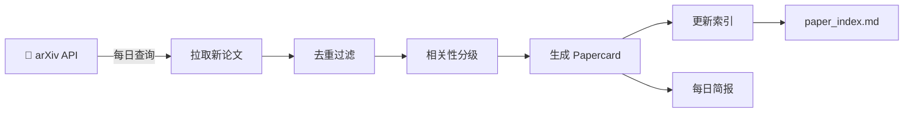

# arXiv 领域订阅系统 — 使用指南

## 🎯 功能概述

自动从 arXiv 拉取你关注的领域新论文 → 按 `Agents.md` 规则生成结构化 Papercard → 每日简报汇总。

### 核心流程



---

## 🚀 快速开始 (3 步)

### 第 1 步：安装依赖

```powershell
cd D:\Research-hub
pip install arxiv pyyaml
```

> 如果使用项目的 conda/venv 环境，先激活环境。

### 第 2 步：修改订阅配置

编辑 `arxiv_subscriber/config.yaml`，调整以下内容：

```yaml
# 1. 修改查询关键词（添加你的研究方向关键词）
categories:
  - name: "UAV-Semantic-Communication"
    queries:
      - "UAV semantic communication"        # ← 修改为你关注的关键词
      - "multi-UAV cooperative sensing"
      # ... 添加更多

# 2. 调整拉取数量
arxiv:
  max_results: 50      # 每个查询最多拉几篇
  lookback_days: 2     # 回溯几天
```

### 第 3 步：运行

```powershell
cd D:\Research-hub\arxiv_subscriber

# 首次运行：拉取 + 生成 papercard
python daily_workflow.py

# 仅拉取不生成（先看有什么论文）
python daily_workflow.py --fetch-only

# 仅生成高相关论文的 papercard
python daily_workflow.py --min-relevance high
```

---

## 📂 输出文件说明

| 输出 | 位置 | 说明 |
|------|------|------|
| 📄 **元数据 CSV** | `metadata/YYYY-MM-DD_arxiv_daily.csv` | 所有拉取论文的元数据（兼容 Zotero 格式） |
| 📝 **Papercard** | `papercard/<分类>/YYYY_Author_Title.md` | 结构化论文简报（按 Agents.md 11 条规则） |
| 📋 **主题索引** | `papercard/<分类>/index.md` | 该主题下所有 papercard 列表 |
| 📊 **总索引** | `paper_index.md` | 自动更新新增记录 |
| 📰 **每日简报** | `arxiv_subscriber/daily_reports/YYYY-MM-DD.md` | 当日论文概览（按相关性分组） |
| 💾 **去重库** | `arxiv_subscriber/processed_ids.json` | 已处理论文 ID，避免重复 |

---

## ⏰ 定时自动运行

### 安装 Windows 定时任务

以**管理员身份**打开 PowerShell：

```powershell
cd D:\Research-hub\arxiv_subscriber

# 安装每日 8:00 自动运行
python setup_scheduler.py --install

# 安装每日 18:00 运行
python setup_scheduler.py --install --hour 18

# 立即测试一次
python setup_scheduler.py --run-now

# 查看任务状态
python setup_scheduler.py --status

# 卸载
python setup_scheduler.py --uninstall
```

### 验证任务

```powershell
# 在 Windows 任务计划程序中查看
taskschd.msc
# 搜索 "ArxivSubscriberDaily"
```

---

## 📝 Papercard 内容说明

每篇自动生成的 papercard 包含 `Agents.md` 定义的 **11 个结构化条目**：

| 条目 | 内容 | 自动生成质量 |
|------|------|-------------|
| §1 Problem | 论文解决的问题偏向 | 🟡 基于摘要推断 |
| §2 Setting | 节点/算力/通信/模态等设定 | 🟡 基于关键词推断 |
| §3 Core Idea | 核心设计思想 | 🟡 基于标题+摘要 |
| §4 Key Mechanism | 关键机制提取 | 🟡 启发式识别 |
| §5 Experiments | 实验与数据集 | 🔴 信息有限 |
| §6 Strength | 值得借鉴处 | 🟡 初步推断 |
| §7 Weakness | 局限与不足 | 🟡 初步推断 |
| §8 Reusable Part | 可复用内容 | 🟡 初步标记 |
| §9 Attack Point | 可改进切入点 | 🟡 初步标记 |
| §10 Relation | 与主线关系 | 🟡 基于分类 |
| §11 Justification | 场景-实验合理化 | 🔴 需 PDF 精读 |

> **重要**：自动生成的 papercard 标记为 `[AUTO]`。**高相关论文请务必人工补充 PDF 精读**，完善 §5/§7/§11 等关键条目。

---

## 🔧 进阶用法

### 自定义工作流

```python
# 在你的脚本中调用
from arxiv_subscriber.fetcher import run_arxiv_fetch
from arxiv_subscriber.generator import run_papercard_generation

# 1. 拉取
papers, csv_path = run_arxiv_fetch()

# 2. 只生成高相关
stats = run_papercard_generation(papers, min_relevance="high")

# 3. 导出特定分类的论文列表
uav_papers = [p for p in papers if "UAV" in p.get("category", "")]
```

### 添加新的订阅领域

编辑 `config.yaml` 中的 `categories` 列表：

```yaml
categories:
  - name: "My-New-Topic"         # 目录名
    label: "我的新研究方向"        # 显示名
    folder: "My-New-Topic"       # papercard 子目录
    queries:
      - "keyword1 keyword2"      # arXiv 搜索词
      - "another query here"
```

### 修改相关性判断规则

编辑 `config.yaml` 中的 `screening` 部分：

```yaml
screening:
  high_keywords:
    - "your important keyword"    # 命中即为高相关
  medium_keywords:
    - "your secondary keyword"
```

---

## ⚠️ 注意事项

1. **arXiv API 礼节**：请求间隔 ≥ 3 秒（config 中 `delay_seconds` 默认为 5 秒）
2. **去重机制**：基于 arXiv ID 去重，已处理论文不会重复生成
3. **自动生成限制**：Papercard 基于摘要生成，信息有限。高相关论文务必人工 PDF 精读
4. **索引更新**：自动更新 `paper_index.md` 和 `papercard/<topic>/index.md`
5. **Python 版本**：要求 Python ≥ 3.8

---

## 📞 常见问题

### Q: 定时任务没有运行？
A: 以管理员身份运行 `python setup_scheduler.py --status` 查看状态，确保 `RunOnlyIfNetworkAvailable` 匹配你的网络环境。

### Q: 拉取不到论文？
A: 检查 `config.yaml` 中的关键词是否正确（在 [arxiv.org](https://arxiv.org) 手动搜索验证）；调整 `lookback_days` 增加回溯天数。

### Q: 如何批量重新生成已有论文的 papercard？
A: 删除 `arxiv_subscriber/processed_ids.json` 中的对应 ID，重新运行工作流。

### Q: 生成的 papercard 质量不高？
A: 自动生成仅基于摘要，是**初筛辅助**。高相关论文请下载 PDF 后按照 `Agents.md` 精读规则手动完善。
