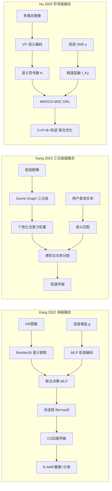

# UAV-Task-Oriented-Communication 三篇论文横向比较

> 对照主线：`paper3_main_thread.md`（conditional semantic collaboration / multi-action selector）

---

## 1. 问题定义演进

| 维度 | Kang 2022 | Kang 2023 | Hu 2025 |
|------|-----------|-----------|---------|
| 核心问题 | 传输哪些图像块？ | 传输哪些语义给哪个用户？ | 如何分配多 UAV 语义通信资源？ |
| 问题类型 | 任务导向传输 | 个性化语义通信 | 多 UAV 语义资源分配 |
| 优化粒度 | 图像块级（4×4 grid） | 三元组级（scene graph） | 语义符号数 K + 功率/带宽/轨迹 |
| 决策视角 | 信道+内容感知 | 用户兴趣感知 | 系统资源感知 |
| 是否有 trigger/reject | ❌ | ❌ | ❌ |

**共性缺陷**：三篇都默认"应该传"——区别只在于"传什么、怎么传"，而没有"该不该传"的决策。这正是当前论文 `conditional semantic collaboration` 的切入点。

---

## 2. 场景设定对比

| 维度 | Kang 2022 | Kang 2023 | Hu 2025 |
|------|-----------|-----------|---------|
| UAV 数量 | 单 UAV | 单 UAV | 多 UAV (M区域，M架) |
| 边缘/云 | MEC 服务器 | 云服务器 | UAV 间中继 |
| 多模态 | 单模态 RGB | 跨模态（图像→文本三元组） | 多模态（图像↔图像 + 图像→文本） |
| 信道模型 | Rayleigh 离散化 | Fisher-Snedecor F 复合衰落 | A2A LoS + A2G LoS/NLoS |
| 轨迹优化 | 无 | 无 | 有（可变飞行距离+角度） |
| 协作机制 | 无 | 无（单 UAV→多用户） | UAV 中继协作 |
| 个性化 | 无 | 用户查询+兴趣权重 | 无 |

**演进趋势**：单 UAV→多 UAV，单模态→多模态，无协作→中继协作。但三篇均未涉及：(a) 异构算力、(b) 图像级触发决策、(c) pair/backend 选择。

---

## 3. 方法机制对比

| 维度 | Kang 2022 | Kang 2023 | Hu 2025 |
|------|-----------|-----------|---------|
| 语义表征 | 块级网格选择 | Scene Graph 三元组 | ViT patch embedding |
| 决策方法 | Policy Gradient (REINFORCE) | 个性化注意力 + NBS 博弈论 | MHDCD-MSC (DDPG+DQN 混合) |
| 优化变量 | 16 个块的 Bernoulli 概率 | 用户/三元组功率分配 | K + P + B + 轨迹 |
| 目标函数 | -α×CE_loss -β×T_up | max Π(sk/˜sk) | max Σ(αq·QoE - αc·Cost) |
| 信道感知 | 输入特征（离散7档） | Fisher-Snedecor F 理论推导 | SNR 作为观测+精度函数拟合 |
| 压缩方式 | 块级 CS (D-AMP) | 三元组编码（文字级压缩） | ViT semantic symbols |

**共性特征**：三篇都使用 DRL/ML 做决策优化，但各自优化的变量层级不同——Kang 2022 优化"选哪些块"（空间选择），Kang 2023 优化"给谁、发多少功率"（用户资源配置），Hu 2025 优化"K/P/B/轨迹"（系统资源配置）。

---

## 4. 实验评价对比

| 维度 | Kang 2022 | Kang 2023 | Hu 2025 |
|------|-----------|-----------|---------|
| 数据集 | AID (30类航拍场景) | Visual Genome + 自定义 UAV | Karpathy splits (123K图像) |
| 精度指标 | 分类准确率 | 匹配得分 sk/˜sk | QoE (双sigmoid) |
| 延迟指标 | T_up 上行延迟 | 未报告 | 传输时间 D |
| 能耗指标 | 隐式（比特数代理） | 功率消耗 | 传输代价（功率+带宽） |
| 带宽指标 | 传输比特数 | 三元组丢弃概率 | 带宽占用 |
| 对比基线数 | ~4 | ~4 | 5（含消融维度） |
| 消融实验 | ❌ 无 | 部分（权重/功率） | ✅ 较好（5基线对应4维） |
| 真实部署 | ❌ 无 | ❌ 无 | ❌ 无 |

**共性缺陷**：三篇均未在真实 UAV 硬件上测试；均未做跨数据集迁移验证；Kang 2022 完全无消融实验。

---

## 5. 与当前论文 (paper3_main_thread) 的对照

| 对照维度 | Kang 2022 | Kang 2023 | Hu 2025 | 当前论文优势 |
|----------|-----------|-----------|---------|------------|
| **是否区分 trigger/reject** | ❌ | ❌ | ❌ | ✅ B0/none vs B2/B3 |
| **是否多动作选择** | ❌ 二值选块 | ❌ 连续功率 | ❌ K离散选择 | ✅ B2_RECALL + B3_TUNED |
| **是否 pair-level 选择** | ❌ 单后端 | ❌ 单UAV | ❌ 中继但无选择 | ✅ front→back pair selection |
| **是否 queue-aware** | ❌ | ❌ | ❌ | ✅ front/back queue delay |
| **是否 budget 约束** | 隐式（带宽限制） | 隐式（功率预算） | 显式（功率/带宽上限） | ✅ 显式 trigger budget + false_trigger constraint |
| **部署可行性** | 中（CS轻量） | 低（Scene Graph需GPU） | 低（ViT+Transformer需GPU） | ✅ 高（17 features, <1ms, 仅OpenCV） |
| **消融实验质量** | 低（无消融） | 中（部分消融） | 高（4维消融） | ✅ 高（5 seed × 4 fraction × 5 budget × 4 feature groups） |
| **跨域验证** | ❌ | ❌ | ❌ | ✅ VisDrone → DroneVehicle |

---

## 6. 共同空白与系统性遗漏

### 6.1 三篇共同忽略的维度

| 空白点 | 具体表现 | 当前论文是否覆盖 |
|--------|---------|:---:|
| Trigger/reject 决策 | 三篇都默认对所有图像执行语义处理 | ✅ |
| Pair/后端选择 | 单 UAV→单后端 或 UAV→用户，无后端选择 | ✅ |
| 图像级增益预测 | 无 per-image utility prediction | ✅ |
| 预算约束的全局触发 | 无"在 budget 下选哪 k 张图触发" | ✅ |
| 诚实消融/负面结果 | 仅 Hu 2025 有部分消融，三篇均无负面报告 | ✅ |
| 跨域验证 | 三篇均单数据集 | ✅ |
| 真实部署延迟测量 | 三篇均无 | 部分（预测器 <1ms） |
| 多视角互补 | Hu 2025 有区域划分但未建模视角互补 | 部分（Layer 2 pair selection） |

### 6.2 可复用素材总结

| 来源 | 可复用内容 | 用途 |
|------|-----------|------|
| Kang 2022 | 信道+内容联合感知架构 | 支撑 Layer 2 中 A2A 链路作为输入特征 |
| Kang 2023 | 个性化 weight 思想、NBS 博弈论 | 支撑 per-image utility 概念；多 pair 竞争情景 |
| Hu 2025 | K 作为优化变量、5 baseline 消融范式 | 支撑"协作动作也是优化变量"论证；实验矩阵设计 |
| 三篇共同 | 无 trigger/reject 的缺失 | Related Work 中定位当前论文独特性的证据 |

---

## 7. 当前论文在三篇面前的定位

三篇论文形成了一个完整的"任务导向语义通信"技术栈：**块选择 → 个性化语义编码 → 多 UAV 多模态资源分配**。但它们都止步于"怎么传更好"，没有触及"该不该传、找谁传"的协作决策问题。

当前论文 `conditional semantic collaboration / multi-action selector` 在这个技术栈上开辟了一个**正交的新维度**——不是替代它们的语义编码或资源分配方案，而是在它们之上增加一层**协作触发与选择逻辑**。这一定位避开了与三篇的正面竞争，同时在 Related Work 中有清晰的叙事：
> "现有工作解决了如何高效语义传输（Kang 2022, 2023; Hu 2025），但忽略了是否应该触发语义协作这一前置决策——本文填补了这一空白。"

---

## 8. 三篇论文如何合理化其算法/模型选择（避免"堆砌创新"质疑）

> 本节的目的是从三篇论文中提取**可复用的论证策略**，回答：它们在写作和实验设计上分别做了什么，来让读者相信"这些算法组件对这个场景是必要的，而不是技术堆砌"？

### 8.1 Kang 2022：论证最弱，但有一个亮点可学

**写作上的合理化手段**：
- **问题驱动的叙事**："UAV 算力受限 → 不能本地推理 → 必须传图像到 MEC → 但带宽有限 → 只能传输最关键的部分 → 用 DRL 学会选关键块"。这条链的逻辑是通的，但问题在于：**DRL 不是唯一解**（CAM、entropy-based selection、rule-based 都可以），论文没有排除替代方案。
- **未讨论 "why DRL, not simpler"**：没有设置 rule-based baseline（如高纹理块优先传输），没有讨论 CAM (Class Activation Map) 作为替代。这是最大的论证漏洞。

**实验上的合理化手段**：
- **无消融实验**：这是致命缺陷。无法证明 ResNet18 + Policy Gradient + D-AMP 三者各自的必要性。
- 仅有横向对比（JPEG2000、content-only saliency、random），但这些都是**不同架构的对比**，不是**同一架构内组件的消融**。

**可学的亮点**——信道+内容联合感知的论证：
- Kang 2022 最成功的一处论证是："信道状态不稳定 → 传输策略需要感知信道 → 将信道增益与图像特征一起输入 policy network"。这一逻辑链是**场景特征→技术需求→算法选择**的标准范式，可以直接复用到当前论文中。

**对当前论文的启示**：
- **避免的错误**：不要像 Kang 2022 那样只做横向对比、不做消融。当前论文的 V/D/H/HC 特征消融恰好弥补了这个缺陷。
- **可学的写法**：Kang 2022 对"信道+内容联合"的论证方式，可以直接平移用于论证当前论文的"A2A 链路质量纳入 pair 选择器"——"A2A 链路质量动态变化 → pair 选择不能只看后端算力 → 必须将链路延迟和排队状态纳入效用函数"。

---

### 8.2 Kang 2023：有部分消融，但核心组件缺乏替代方案排除

**写作上的合理化手段**：
- **"未被探索的挑战"定位**：论文将贡献表述为"现有工作忽略了 X 和 Y 两个挑战"，而非"我们用了 A、B、C 三种前沿技术"。这种**问题驱动而非技术驱动的贡献表达**值得学习。
- **个性化需求的场景论证较强**："不同用户兴趣不同 → 语义编码不能一刀切 → 需要个性化权重"。这条链的场景→技术映射是自然的。

**实验上的合理化手段**：
- **部分消融**：个性化权重 vs. 均匀权重、NBS vs. equal power——这两组对比可以证明个性化编码和博弈论分配各自的独立贡献。
- **缺失的关键消融**：没有"无 Scene Graph（用 CLIP embedding 或直接 CNN feature 匹配）"的对照——这是最大的论证漏洞，因为 Scene Graph 提取的计算代价远高于简单的 embedding 匹配。

**对当前论文的启示**：
- **可学的贡献表达**：Kang 2023 的"现有工作忽略了 X 和 Y"的写法，可以改造为当前论文的"现有语义通信工作解决了 how to transmit（Kang 2022, Hu 2025）和 what to transmit（Kang 2023），但忽略了 whether to collaborate"。
- **可学的消融组织**：NBS vs. equal power 的对比说明，**数学优化方法（博弈论）需要一个简单的规则 baseline 来证明其必要性**。这对当前论文的启示：如果 Layer 2 用了优化求解器选 pair，必须与 random pair / nearest pair 等简单规则 baseline 对比。

---

### 8.3 Hu 2025：论证最强，消融范式最值得模仿

**写作上的合理化手段**：
- **"增量贡献"框架**："We extend our prior work [1] by introducing collaborative relay communication and trajectory optimization"。这种表述将自己定位为**在前人基础上的增量改进**，而非"全新架构"，有效降低了"堆砌"的嫌疑。
- **每个机制对应一个场景约束**：多模态 ↔ 紧急救援需图文双通道、UAV 中继 ↔ 跨区域信息需求、可变 K ↔ 信道动态变化需自适应压缩、轨迹优化 ↔ UAV 机动性可用于改善链路。这种**一一对应的场景→技术映射**是三篇中最完整的。
- **"to the best of our knowledge" 的谨慎使用**：只在最后总结时使用，不在引言中过度夸大。

**实验上的合理化手段**（三篇中最强）：
5 个 baseline 清晰对应 4 个维度的独立贡献：

| Baseline | 消融的维度 | 证明了什么 |
|----------|-----------|-----------|
| MHDCD-MSCFP（固定位置） | 轨迹优化 | 轨迹可变比固定位置好 |
| MHDCD-ISC（仅图像模态） | 多模态 | 图+文比纯图好 |
| MADDPG-ISCFS（固定 K=256） | 可变 K | K 可调比固定好 |
| MADDPG-TC（传统编码） | 语义通信本身 | 语义通信比传统编码好 |
| EA-MSC（均等分配） | 智能资源分配 | DRL 比均等分配好 |

**这种设计的精髓**：每一个 baseline 只改变一个维度，其他条件保持一致。这正是"消融"的标准范式。

**对当前论文的启示**（最重要）：
- 当前论文的实验矩阵应仿照这个范式设计 baseline：
  - `always-B2` → 消融 trigger 决策
  - `always-none (B0)` → 消融协作本身
  - `random-trigger-at-budget` → 消融 utility prediction
  - `fixed-pair (always nearest)` → 消融 pair selection
  - `V-feature only, no budget constraint` → 消融 budget

---

### 8.4 三篇论证策略总结与当前论文可采取的行动

| 论证策略 | Kang 2022 | Kang 2023 | Hu 2025 | 当前论文是否已做到 |
|----------|:---:|:---:|:---:|:---:|
| 场景→技术一一映射 | 弱 | 中 | 强 | 待加强（需在论文中显式写出来） |
| 每个组件对应一个消融 baseline | ❌ | 部分 | ✅ | ✅ V/D/H/HC + B2/B3 |
| "why not simpler" 讨论 | ❌ | ❌ | 部分 | 待补（需解释 why Ridge not DNN） |
| 简单 rule-based baseline | ❌ | 部分 | ✅ | 待补（random trigger, fixed pair） |
| 贡献表达为"问题驱动"而非"技术驱动" | 中 | 强 | 强 | 当前 §10 Relation 已体现 |
| 诚实报告负面结果 | ❌ | ❌ | ❌ | ✅ H 过拟合、B3 负效用 |

---

## 9. 可复用素材的详细复用方案

> 针对 `overview.md` §6.2 中列出的可复用素材，本节逐一说明**具体如何复用到当前论文**。

### 9.1 Kang 2022 → 支撑 Layer 2 中 A2A 链路作为输入特征

**原始机制**（Kang 2022）：
- 输入：(LR 预览图, 信道增益 g) → 两路编码器（ResNet18 + MLP）→ 融合 MLP → 输出块选择概率
- 核心思想：信道质量不是后验约束，而是**决策输入**

**复用到当前论文 Layer 2（Pair 选择器）**：

当前 Layer 2 的 utility formula 已经包含了 A2A 链路延迟：
```
pair_extra_latency = semantic_extra_latency
                   + front_to_back_tx_ms(payload, A2A rate, RTT)
                   + front_queue_delay_ms
                   + back_queue_delay_ms
```

**Kang 2022 提供的外部证据**：
- "将信道状态作为决策输入（而非仅作为约束）可以提升系统性能"——Kang 2022 在图 6-8 中展示了信道感知比纯内容感知精度更高
- 这为当前论文的设计提供了外部支撑：**把 A2A 链路质量纳入 pair 选择器不是画蛇添足，而是有文献前例的必要设计**

**具体写作用法**：
在 Related Work 或方法设计说明中引用 Kang 2022 的发现：
> "Kang et al. [2022] demonstrated that incorporating channel state as a decision input, rather than treating it solely as a post-hoc constraint, improves task-oriented transmission performance. Inspired by this finding, our pair selector explicitly feeds A2A link quality into the utility function alongside perceptual gain."

**实验上的复用**：
可以仿照 Kang 2022 的消融（虽然它自己没有做）：在当前论文中增加一个 `link-agnostic` baseline——utility 公式中移除 A2A 延迟项，仅用感知增益选择 pair——来证明链路感知的必要性。

---

### 9.2 Kang 2023 → 支撑 per-image utility 概念 + 多 pair 竞争情景

**原始机制**（Kang 2023）：
- **个性化 weight**：每个用户对不同三元组（语义内容）赋予不同权重 → 同一组语义对不同用户价值不同
- **NBS 博弈论**：多个用户竞争 UAV 的功率资源 → NBS 找到公平性-效率最优的分配方案

**复用到当前论文：per-image utility 概念**：

当前论文的一个核心设计是：**不是所有图像都适合同一个协作动作**——B2 适合退化图像（提升召回），B3 在某些图像上净效用为负。这与 Kang 2023 的"个性化"逻辑同构：

| Kang 2023 | 当前论文 |
|-----------|---------|
| 不同用户对不同三元组兴趣不同 | 不同图像对 B2/B3 的效用不同 |
| 个性化权重 = f(用户查询, 三元组) | per-image utility = f(图像特征, action) |
| 用户得到个性化语义推送 | 图像得到个性化的触发决策 |

**写作上的复用**：
> "Kang et al. [2023] showed that a uniform semantic encoding strategy is suboptimal when receivers have heterogeneous interests—personalized weighting improves user satisfaction. Our work extends this insight from the user dimension to the image dimension: just as different users benefit differently from the same semantic content, different images benefit differently from the same collaboration action."

**复用到当前论文：多 pair 竞争情景**：

当前论文的 Layer 2 隐含了一个问题：一个 front UAV 面对多个候选 back UAV，如何分配协作"名额"？

Kang 2023 的 NBS 博弈论提供了一个建模方案：
- **原始**：max Π(sk/˜sk)——最大化所有用户匹配得分的乘积，保证公平性和效率
- **改造**：max Π(utility_i)——最大化所有 (front, back_i, action) pair 的 utility 乘积，在多个 back 之间公平分配协作机会

**具体建模**：
```
max Π_{back_i} U(front, back_i, action_i)
s.t. Σ trigger_count(back_i) ≤ budget  -- 总触发预算
    每个 back 的排队容量约束
```

**写作上的复用**：
在 Layer 2 的扩展讨论或 future work 中提到：
> "When a front UAV faces multiple candidate back UAVs with heterogeneous A2A link quality and queue states, the pair selection problem resembles the multi-user resource competition in Kang et al. [2023], where Nash bargaining can balance fairness and efficiency across competing receivers."

---

### 9.3 Hu 2025 → 支撑"协作动作也是优化变量"论证 + 实验矩阵设计

**原始机制**（Hu 2025）：
- **K 作为优化变量**：语义符号数不是固定的模型超参数，而是**每时步由 DRL 根据信道和任务动态选择**的决策变量
- **5 baseline 消融范式**：每个 baseline 单独消融一个维度

**复用到当前论文："协作动作也是优化变量"论证**：

这是三篇中对当前论文最有价值的论证素材。逻辑链如下：

| Hu 2025 的逻辑 | 平移后的当前论文逻辑 |
|---------------|-------------------|
| 语义符号数 K 影响精度和传输代价 | 协作动作 (B0/B2/B3) 影响检测效用和通信代价 |
| K 不应固定——好信道多传、差信道少传 | 动作不应固定——高增益图像触发 B2/B3、低增益图像保持 B0 |
| Hu 2025 用 DRL 动态选 K | 当前论文用 Ridge predictor 预测 per-image utility 再选 action |
| Hu 2025 证明可变 K > 固定 K=256 | 当前论文证明 predictor-driven trigger > always-B2 |

**写作上的复用**（最关键的论证段落）：
> "Hu et al. [2025] recently demonstrated that treating the number of transmitted semantic symbols K as a dynamic optimization variable—rather than a fixed hyperparameter—significantly improves the QoE-cost tradeoff in multi-UAV semantic communication. Their finding reveals a broader principle: in resource-constrained UAV systems, communication-related decisions that were traditionally treated as static configurations should be made adaptive to per-instance conditions.
>
> Our work applies this principle to a different decision layer: instead of optimizing how many semantic symbols to transmit (Hu 2025), we optimize which collaboration action to trigger and which backend UAV to engage. Just as K should vary with channel quality, the choice between B0 (local-only), B2 (recall-oriented review), and B3 (balanced augmentation) should vary with the predicted utility of each image-action pair."

这段论证直接回应审稿人的质疑："为什么不总是触发 B2？为什么需要选择器？"——因为 Hu 2025 已经证明"不总是传同样的 K 比固定 K 好"，同理"不总是触发同样的协作动作比 always-trigger 好"。

**复用到当前论文：实验矩阵设计**：

Hu 2025 的 5 baseline 范式可以直接翻译为当前论文的 baseline 设计：

| Hu 2025 的 baseline | 对应的当前论文 baseline | 消融的维度 |
|---------------------|----------------------|-----------|
| MHDCD-MSCFP（固定位置） | `fixed-pair`（固定选择最近 back） | pair selection |
| MHDCD-ISC（仅图像模态） | `B2-only`（仅支持 B2，无 B3 选择） | multi-action |
| MADDPG-ISCFS（固定 K=256） | `always-B2` / `always-B3`（固定触发动作） | trigger decision |
| MADDPG-TC（传统编码） | `always-none (B0)`（无协作） | collaboration |
| EA-MSC（均等分配） | `random-trigger-at-budget`（随机触发） | utility prediction |

**实验写作上的复用**：
在论文的实验设计部分，可以这样组织：
> "Following the ablation paradigm of Hu et al. [2025], we design five baselines, each isolating one component of our framework: (1) always-none to ablate collaboration itself, (2) always-B2 to ablate the trigger decision, (3) random-trigger-at-budget to ablate utility prediction, (4) B2-only to ablate multi-action selection, and (5) fixed-pair to ablate pair selection."

---

### 9.4 三条复用线索的整体关系

```
Kang 2022                     Kang 2023                     Hu 2025
信道=决策输入                  个性化=per-instance差异        K=动态优化变量
    │                              │                            │
    ▼                              ▼                            ▼
Layer 2:                       Layer 3:                      整体论证:
A2A链路纳入                    per-image utility             "协作动作也是
pair选择器                     预测器设计                    动态优化变量"
utility formula                                                  │
                                                               ▼
                                                        5-baseline实验矩阵
                                                        消融范式
```

三条复用线索分别支撑当前论文的**方法设计（Layer 2）**、**核心概念（per-image utility）**、**论证框架（动态优化 + 消融范式）**——形成了一个从具体机制到整体叙事的外部证据链。

---

## 10. 三篇论文的 CV-通信融合机制分析

> 本节回答一个核心问题：三篇论文分别通过什么技术手段将计算机视觉（CV）与无线通信这两个领域**有机融合**在一起（而非简单堆叠），形成"CV 感知什么、通信就传输什么、两者为同一任务目标服务"的闭环？

### 10.1 融合架构总览

三篇论文的 CV-通信融合可以统一描述为一条 **"语义提取→语义传输→任务验证"** 流水线，但各自的融合深度、耦合方式和铰链变量不同：



### 10.2 逐个深度分析

#### 10.2.1 Kang 2022 — "信道-内容联合感知"：CV 与通信在**决策输入端**融合

**融合机制**：
Kang 2022 的 CV-通信融合发生在 **Policy Network 的输入端**。它的核心设计是将图像特征（CV 域）和信道增益（通信域）作为**并列输入**，送入同一个 MLP 联合决策器：

```
输入 = [ResNet18(图像) ∥ MLP(信道增益)]  →  联合MLP  →  16个块的传输概率
       └── CV 信号 ──┘   └── 通信信号 ──┘      ↑
                                          两者在此融合
```

**融合的有机性体现在哪里**：
1. **不是 CV 做完再传给通信**：信道状态直接影响"哪些图像块值得传输"的决策——差信道下自动少传块、好信道下多传块。CV 的语义选择被通信条件调制。
2. **单一损失函数同时优化两端**：`reward = -α×CE_loss - β×T_up`，分类精度（CV 目标）和传输延迟（通信目标）在同一个梯度中优化。
3. **CV 的输出不是最终产物**：ResNet18 提取的特征不是为了分类，而是为了"在给定信道下决定传哪些块"——CV 模型被通信需求重塑。

**铰链变量**：**16 个块的 Bernoulli 选择概率** — 它是 CV（哪些块分类贡献大）和通信（信道能承载多少块）博弈的结果。

**融合深度评估**：★★★☆☆（中等）— 输入端融合，但 CV 和通信仍是两个独立的编码器，仅在决策层交汇。

---

#### 10.2.2 Kang 2023 — "语义驱动功率分配"：CV 与通信在**资源分配层**融合

**融合机制**：
Kang 2023 的独特之处在于：CV 的产物（Scene Graph 三元组 + 个性化权重）直接成为通信资源分配的依据。融合链路为：

```
图像 → CV: Scene Graph 三元组 (subject, predicate, object)
  │
  ├─→ 通信 Phase 1: 三元组编码 + 无线传输
  │
  └─→ 用户: 文本查询匹配 → 个性化注意力权重 w_k
         │
         └─→ 通信 Phase 2: 按 w_k 分配功率 → NBS 博弈论优化
```

**融合的有机性体现在哪里**：
1. **语义内容决定通信资源分配**：CV 提取的三元组不是均匀传输的——与用户兴趣更相关的三元组获得更高的编码权重和更多的功率保护。通信资源（功率）的分配依据来自 CV 语义理解。
2. **跨模态语义桥接**：图像（CV）→ 三元组（语义中间表示）→ 文本查询（用户需求）→ 功率分配（通信），形成了一条跨模态的语义-通信链。
3. **效用函数的 CV 根**：优化目标 `max Π(sk/˜sk)` 中的匹配分数 sk 完全来自 CV 侧的 Scene Graph 匹配质量——通信优化的效果最终由 CV 任务指标衡量。

**铰链变量**：**个性化注意力权重 w_k** — 它是 CV（三元组-查询语义匹配度）向通信（功率分配优先级）传递信息的载体。

**融合深度评估**：★★★★☆（较深）— CV 的语义理解直接塑造了通信的资源分配策略，但 Scene Graph 生成和通信优化仍是两个独立的阶段。

---

#### 10.2.3 Hu 2025 — "K 作为 CV-通信联合变量"：CV 与通信在**优化变量层**融合

**融合机制**：
Hu 2025 实现了三篇中最深层的 CV-通信融合：**语义符号数 K 同时是 CV 概念（语义压缩程度）和通信概念（传输 payload）**，成为 CV 和通信的共同优化变量。

```
CV 视角的 K: 语义符号越多 → 重建精度越高 → SSIM/BLEU 越好
通信视角的 K: 语义符号越多 → 传输比特数越大 → 延迟/带宽消耗越大

两者通过 f_J(K, γ) 耦合:
  f_J(K, γ) = sigmoid(a×log(K) + b×γ_dB + c)
  ↑ 精度（CV）  ↑ 符号数    ↑ 信道（通信）
```

**融合的有机性体现在哪里**：
1. **K 是 CV 和通信的"共享语言"**：CV 关心"保留多少语义信息"（用 K 量化），通信关心"传输多少数据"（用 K 量化）——同一个 K 在两个领域有双重含义，天然耦合。
2. **精度函数 f_J(K,γ) 是融合的数学桥梁**：这个函数将 CV 精度、语义符号数 K、信道 SNR γ 三者绑定在一起——CV 和通信不再是两个子系统，而是同一数学函数的自变量。
3. **混合决策 DRL 统一优化**：actor 先为每个候选 K 生成最优连续动作 (P, B, 轨迹)，critic 再选最高 Q 值的 K——CV 的质量（K 的影响）和通信的代价（P, B 的影响）在同一个 Q 函数中被权衡。
4. **多模态为融合提供弹性**：图→文本模态提供了"降级但不断连"的选项——当通信资源不足以支撑图像传输时，系统自动降级到文本模态，CV 任务仍可继续（只是精度降低）。

**铰链变量**：**语义符号数 K + 精度函数 f_J(K,γ)** — K 是 CV-通信的双面变量，f_J 是融合的数学模型。

**融合深度评估**：★★★★★（最深）— CV 和通信共用一个优化变量 K，通过精度函数数学耦合，DRL 统一决策。

---

### 10.3 三篇融合机制对比

| 融合维度 | Kang 2022 | Kang 2023 | Hu 2025 |
|----------|-----------|-----------|---------|
| **融合切入点** | 决策输入端 | 资源分配依据 | 优化变量定义 |
| **CV 提供给通信的** | 图像块分类贡献度 | Scene Graph + 个性化权重 | 语义符号数 K 的质量映射 |
| **通信反馈给 CV 的** | 信道状态 → 选块策略调整 | 功率分配 → 关键三元组保护 | K 选择 → 语义压缩程度 |
| **铰链变量** | 16块 Bernoulli 概率 | 个性化权重 w_k | K + 精度函数 f_J(K,γ) |
| **融合数学形式** | 联合特征空间 + 统一 reward | 博弈论目标函数 | 精度函数 + Q 函数 |
| **CV 模型被通信改变** | ✅ 信道状态改变了块选择 | ❌ Scene Graph 独立生成 | ✅ K 改变了语义编码程度 |
| **通信策略被 CV 改变** | ✅ 块级语义 → 选择性传输 | ✅ 语义匹配度 → 功率优先级 | ✅ 精度函数 → K 决策 |
| **端到端梯度** | ✅ Policy Gradient | ❌ 两阶段分离优化 | ✅ DDPG+DQN 混合 |
| **融合深度** | ★★★☆☆ | ★★★★☆ | ★★★★★ |

### 10.4 融合范式的演进逻辑

三篇论文体现了 CV-通信融合的三个递进层次：

```
Kang 2022                Kang 2023                  Hu 2025
"输入级融合"      →      "语义级融合"       →      "变量级融合"
CV+信道共同输入           CV语义决定通信资源          CV-通信共享优化变量
两路编码器→交汇           语义匹配→功率分配          K 是双面铰链
```

**关键趋势**：
1. **从"拼接"到"共享"**：Kang 2022 是将 CV 和通信特征拼接后决策（两路编码器），Hu 2025 是让两者共享同一个优化变量 K（不需拼接，天然耦合）。
2. **从"两阶段"到"端到端"**：Kang 2023 是先 CV 提取语义再通信分配功率（两阶段松散耦合），Hu 2025 是 DRL 统一优化 K+P+B+轨迹（端到端紧耦合）。
3. **从"隐式耦合"到"显式数学耦合"**：Kang 2022 的耦合隐藏在神经网络黑盒中，Hu 2025 通过 f_J(K,γ) 给出了显式的 CV-通信精度函数——耦合可解释、可分析。

### 10.5 三篇共同的融合局限

尽管融合深度递进，三篇仍共享以下局限：

| 局限 | 具体表现 | 当前论文是否突破 |
|------|---------|:---:|
| **融合仅发生在单链路** | 都是 UAV→MEC/UAV→用户 的单条链路，未涉及多链路选择 | ✅ Layer 2 pair 选择器考虑多后端 |
| **CV 任务固定不可切换** | 分类/匹配/重建——任务确定后 CV 模型不变 | 部分（B2/B3 是不同融合策略） |
| **缺少 CV 质量对通信的反向约束** | 如果 CV 提取质量差（如低质量图像），通信是否白白浪费资源？三篇均无此判断 | ✅ B0/none 动作 = 检测"CV 质量不足→不触发通信" |
| **缺少"通信收益 vs. CV 增益"的显式建模** | 没有回答"传了这张图的语义，下游 CV 任务到底提升了多少" | ✅ utility = predicted_delta_quality − λ×cost |
| **无通信代价感知的 CV 触发开关** | 所有图像都走 CV→通信流程，没有"这张图不值得处理"的判断 | ✅ 这是当前论文的核心贡献 |

### 10.6 对当前论文 CV-通信融合设计的启示

当前论文的 CV-通信融合可以定位为**第四层融合范式——"条件触发式融合"**：

```
Kang 2022: 输入级融合 → CV+通信特征拼接
Kang 2023: 语义级融合 → CV语义驱动通信资源
Hu 2025:   变量级融合 → CV-通信共享 K 变量
当前论文:   条件触发式融合 → CV增益预测→条件性触发通信
```

**具体融合机制**：
1. **CV 产物（proposal metadata）是通信的决策依据**：检测框数量、置信度、类别分布 → 预测 B2/B3 效用
2. **通信代价（A2A 延迟+排队+payload）反向约束 CV 协作**：效用公式中的 λ 惩罚项 → 只在高净收益时触发
3. **CV 质量判断（V 特征）直接决定是否启动通信**：低质量图像 → B0 → 零通信开销
4. **B2 和 B3 是两种不同的 CV-通信融合策略**：B2 = CV召回优先+少通信（仅传 metadata），B3 = CV精度优先+多通信（传更多特征）

**在写作中可使用的对比定位**：
> "Existing works integrate CV and communication at the input (Kang 2022), semantic (Kang 2023), or variable (Hu 2025) levels—yet all assume communication should always occur. Our work introduces a conditional fusion paradigm: CV predicts whether communication is worthwhile before committing resources."

这一表述直接建立了与前人工作的递进关系，同时清晰定义了当前论文的融合创新点。
